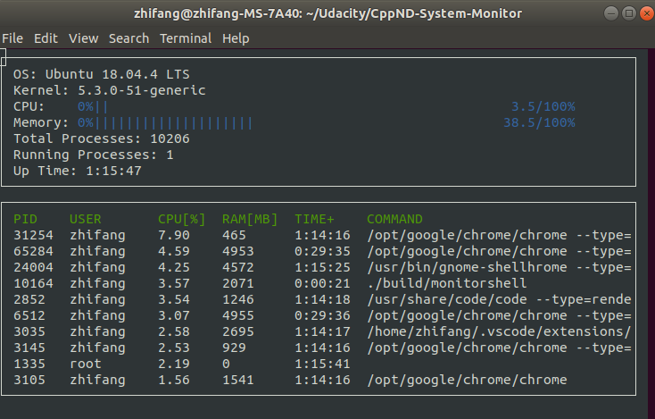

# **Linux System Monitor**
---

## Introduction
_**Note:** This project makes use of [Udacity System Monitor Project Repository](https://github.com/udacity/CppND-System-Monitor)._

In this project, a simple system monitor is built to display system information such as memory utilization, running processes, system runtime, etc. similar to a task manager on Window. The final output of this project is shown as the figure below.

## Instruction
### Dependencies
* [ncurses](https://www.gnu.org/software/ncurses/)
  * ncurses is a library that facilitates text-based graphical output in the terminal. It is used for displaying the final output in the terminal in this project.    
To install ncurses:  
`sudo apt install libncurses5-dev libncursesw5-dev`

### Make
This project uses [Make](https://www.gnu.org/software/make/). The Makefile has four targets:
* `build` compiles the source code and generates an executable
* `format` applies [ClangFormat](https://clang.llvm.org/docs/ClangFormat.html) to style the source code
* `debug` compiles the source code and generates an executable, including debugging symbols
* `clean` deletes the `build/` directory, including all of the build artifacts

### Run the code

1. Clone the project repository: `git clone https://github.com/zftan0709/CppND-System-Monitor-Project-Updated.git`

2. Build the project: `make build`

3. Run the resulting executable: `./build/monitor`

